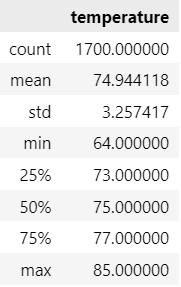
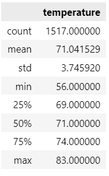

# SQL_Weather_Analysis

## Overview of Analysis

This analysis leveraged SQLAlchemy, Flask, and other tools in Python (pandas, numpy) to provide stakeholders with weather insights to inform decision-making. We used a SQLite database of data from weather stations on Ohahu that contained the weather station id, the date, the temperature, and the precipitation from 2010 to 2018.

The deliverables contained in June_Dec_Analysis.ipynb are summary statistics for the temperatures in June and December, across all 8 years of data collected. 

## Results

### June Summary Statistics

### December Summary Statistics 

Some major points from the two analysis deliverables include:

* The mean temperatuer for June and December are similar; June has a mean of 74.9 and December has a mean of 71.0.  

* The standard deviation in temperatures is similar and relatively small for both moths; June at 3.3 and December at 3.6. We see a 3 to 4 degree difference between the all of the quartiles (i.e. 25% 69:73, 75% 74:77).

* The largest difference can be seen in the minimum temperatures (64 for June and 56 for December), though the max temperatures are very close (85 for June and 83 for December). 

## Summary 

Overall, we see consistent temperatures for each month individually (standard deviation of only 3 degrees) as well as a small, consistent difference in temperatures in June compared to December (a decrease in temperature of 3 to 4 degrees). 

This analysis could benefit from additional queries to gain more insight into the weather conditions on Oahu. For example, we could examine precipitation comparisons for June and December. We could also use the location of different stations to examine differences across microclimates on Oahu. 